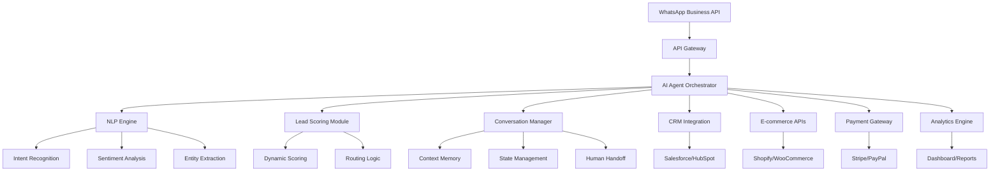

# Exemplos Práticos de Implementação - Ferramentas Agênticas WhatsApp

*Guia Técnico Complementar por MiniMax Agent - 17 de novembro de 2025*

## 🚀 Implementação Prática: Da Teoria à Execução

### **Arquitetura de Sistema Escalável**



---

## 🤖 Código: Implementação de Agente Inteligente

### **1. Agente Principal com NLP Integration**

```python
import openai
import json
from typing import Dict, List, Optional
from dataclasses import dataclass
from enum import Enum

class IntentType(Enum):
    LEAD_QUALIFICATION = "lead_qualification"
    PRODUCT_INQUIRY = "product_inquiry"
    SCHEDULING = "scheduling"
    PAYMENT = "payment"
    SUPPORT = "support"
    GENERAL = "general"

@dataclass
class LeadProfile:
    name: Optional[str] = None
    email: Optional[str] = None
    phone: Optional[str] = None
    company: Optional[str] = None
    budget_range: Optional[str] = None
    timeline: Optional[str] = None
    pain_points: List[str] = None
    intent_score: float = 0.0
    priority_level: str = "medium"
    
    def __post_init__(self):
        if self.pain_points is None:
            self.pain_points = []

class IntelligentWhatsAppAgent:
    def __init__(self, openai_api_key: str, whatsapp_config: Dict):
        self.openai_client = openai.OpenAI(api_key=openai_api_key)
        self.whatsapp_config = whatsapp_config
        self.conversation_history = {}
        self.lead_database = {}
        
    async def process_message(self, message: str, sender_id: str) -> Dict:
        """Processa mensagem e retorna resposta inteligente"""
        
        # 1. Análise de Intenção
        intent = await self._analyze_intent(message)
        
        # 2. Extração de Entidades
        entities = await self._extract_entities(message)
        
        # 3. Atualização do Perfil do Lead
        lead_profile = self._update_lead_profile(sender_id, entities)
        
        # 4. Geração de Resposta Contextual
        response = await self._generate_response(message, intent, lead_profile)
        
        # 5. Logging para Analytics
        await self._log_interaction(sender_id, intent, lead_profile)
        
        return {
            "response": response,
            "intent": intent.value,
            "lead_score": lead_profile.intent_score,
            "requires_handoff": lead_profile.intent_score > 0.8,
            "next_action": self._determine_next_action(intent, lead_profile)
        }
    
    async def _analyze_intent(self, message: str) -> IntentType:
        """Analisa a intenção da mensagem usando GPT"""
        
        prompt = f"""
        Analyze the following WhatsApp message and classify the intent:
        
        Message: "{message}"
        
        Possible intents:
        - lead_qualification: User wants to learn about services, pricing, or has business needs
        - product_inquiry: Specific questions about products or services
        - scheduling: Wants to book appointments, demos, or meetings
        - payment: Questions about payments, billing, or transactions
        - support: Needs help, has problems, or technical issues
        - general: Casual conversation or other purposes
        
        Respond with just the intent name.
        """
        
        response = self.openai_client.chat.completions.create(
            model="gpt-4",
            messages=[{"role": "user", "content": prompt}],
            max_tokens=50
        )
        
        intent_text = response.choices[0].message.content.strip().lower()
        
        try:
            return IntentType(intent_text)
        except ValueError:
            return IntentType.GENERAL
    
    async def _extract_entities(self, message: str) -> Dict:
        """Extrai entidades importantes da mensagem"""
        
        prompt = f"""
        Extract key information from this WhatsApp message:
        "{message}"
        
        Return a JSON object with:
        - name: person's name if mentioned
        - email: email addresses
        - phone: phone numbers
        - company: company or organization names
        - budget: budget ranges or price mentions
        - timeline: time references or urgency indicators
        - pain_points: problems or challenges mentioned
        
        Return only the JSON, no other text.
        """
        
        response = self.openai_client.chat.completions.create(
            model="gpt-4",
            messages=[{"role": "user", "content": prompt}],
            max_tokens=200
        )
        
        try:
            return json.loads(response.choices[0].message.content)
        except json.JSONDecodeError:
            return {}
    
    def _update_lead_profile(self, sender_id: str, entities: Dict) -> LeadProfile:
        """Atualiza o perfil do lead com novas informações"""
        
        if sender_id not in self.lead_database:
            self.lead_database[sender_id] = LeadProfile()
        
        lead = self.lead_database[sender_id]
        
        # Atualiza campos identificados
        for field, value in entities.items():
            if value and hasattr(lead, field):
                setattr(lead, field, value)
        
        # Calcula score de intenção
        lead.intent_score = self._calculate_intent_score(lead, entities)
        
        return lead
    
    def _calculate_intent_score(self, lead: LeadProfile, entities: Dict) -> float:
        """Calcula score de qualificação do lead"""
        score = 0.0
        
        # Base score para qualquer interação
        score += 0.1
        
        # Informações de contato fornecidas
        if lead.email: score += 0.2
        if lead.phone: score += 0.15
        if lead.company: score += 0.2
        
        # Informações de negócio
        if lead.budget_range: score += 0.15
        if lead.timeline: score += 0.1
        
        # Sinais de urgência
        if any(word in str(entities).lower() for word in 
               ['urgent', 'asap', 'immediately', 'soon', 'deadline']):
            score += 0.1
        
        return min(score, 1.0)
    
    async def _generate_response(self, message: str, intent: IntentType, lead: LeadProfile) -> str:
        """Gera resposta contextual baseada na intenção e perfil"""
        
        system_prompt = f"""
        You are an expert sales assistant for a real estate technology company (NatPropTech).
        
        Lead Profile:
        - Name: {lead.name or 'Not provided'}
        - Company: {lead.company or 'Not provided'}
        - Intent Score: {lead.intent_score:.2f}
        - Priority: {lead.priority_level}
        
        Provide a helpful, professional response that:
        1. Addresses their specific need based on intent
        2. Asks qualifying questions if score is low
        3. Offers next steps (demo, meeting, information)
        4. Maintains conversational tone suitable for WhatsApp
        5. Keeps response under 300 characters
        
        User message: "{message}"
        """
        
        response = self.openai_client.chat.completions.create(
            model="gpt-4",
            messages=[
                {"role": "system", "content": system_prompt},
                {"role": "user", "content": message}
            ],
            max_tokens=150,
            temperature=0.7
        )
        
        return response.choices[0].message.content.strip()
    
    def _determine_next_action(self, intent: IntentType, lead: LeadProfile) -> Dict:
        """Determina próxima ação baseada na análise"""
        
        if lead.intent_score > 0.8:
            return {
                "action": "schedule_demo",
                "urgency": "high",
                "assigned_to": "senior_sales_agent"
            }
        elif lead.intent_score > 0.5:
            return {
                "action": "send_info_package",
                "urgency": "medium",
                "assigned_to": "automated_sequence"
            }
        else:
            return {
                "action": "continue_qualification",
                "urgency": "low",
                "assigned_to": "ai_agent"
            }
    
    async def _log_interaction(self, sender_id: str, intent: IntentType, lead: LeadProfile):
        """Registra interação para analytics"""
        
        log_entry = {
            "timestamp": "2025-11-17T22:45:27Z",
            "sender_id": sender_id,
            "intent": intent.value,
            "intent_score": lead.intent_score,
            "lead_qualification": {
                "has_email": bool(lead.email),
                "has_phone": bool(lead.phone),
                "has_company": bool(lead.company),
                "has_budget": bool(lead.budget_range)
            }
        }
        
        # Aqui você salvaria no banco de dados ou serviço de analytics
        print(f"Logging interaction: {json.dumps(log_entry, indent=2)}")

# Exemplo de uso
async def main():
    # Configuração (normalmente viria de variáveis de ambiente)
    config = {
        "whatsapp_token": "your_whatsapp_token",
        "phone_number_id": "your_phone_number_id"
    }
    
    # Inicializar agente
    agent = IntelligentWhatsAppAgent(
        openai_api_key="your_openai_key",
        whatsapp_config=config
    )
    
    # Processar mensagem recebida
    result = await agent.process_message(
        message="Olá, tenho interesse em seus serviços para minha empresa. Precisamos de uma solução urgente.",
        sender_id="5511999999999"
    )
    
    print("Response:", result["response"])
    print("Intent Score:", result["lead_score"])
    print("Next Action:", result["next_action"])

# asyncio.run(main())
```

### **2. Sistema de Roteamento Multi-Agente**

```python
from abc import ABC, abstractmethod
from typing import Protocol

class AgentProtocol(Protocol):
    async def handle_request(self, request: Dict) -> Dict:
        ...

class SeniorSalesAgent:
    async def handle_request(self, request: Dict) -> Dict:
        """Agente especializado em leads qualificados"""
        
        lead_score = request.get("lead_score", 0)
        
        if lead_score > 0.8:
            return {
                "response": f"Olá {request.get('lead_name', '')}! "
                          f"Vou conectar você com nosso especialista para uma "
                          f"demonstração personalizada. Posso agendar para hoje mesmo?",
                "action": "schedule_immediate_demo",
                "priority": "high"
            }
        else:
            return {"response": "Obrigado pelo interesse! Nosso time retornará em breve.", 
                   "action": "queue_for_followup"}

class AutomatedSequenceAgent:
    async def handle_request(self, request: Dict) -> Dict:
        """Agente para sequências automatizadas"""
        
        return {
            "response": "Perfeito! Vou enviar um email com informações detalhadas "
                       "sobre nossas soluções. Também vou incluir alguns casos "
                       "de sucesso do seu setor.",
            "action": "send_info_sequence",
            "priority": "medium"
        }

class QualificationAgent:
    async def handle_request(self, request: Dict) -> Dict:
        """Agente para qualificação de leads"""
        
        return {
            "response": "Ótimo! Para te ajudar melhor, preciso saber: "
                       "1) Qual o tamanho da sua empresa? "
                       "2) Qual seu orçamento estimado? "
                       "3) Qual sua urgência?",
            "action": "continue_qualification",
            "priority": "low"
        }

class AgentRouter:
    def __init__(self):
        self.agents = {
            "senior_sales": SeniorSalesAgent(),
            "automated_sequence": AutomatedSequenceAgent(),
            "qualification": QualificationAgent()
        }
    
    async def route_request(self, request: Dict) -> Dict:
        """Roteia requisição para o agente apropriado"""
        
        next_action = request.get("next_action", {})
        assigned_to = next_action.get("assigned_to", "qualification")
        
        if assigned_to in self.agents:
            return await self.agents[assigned_to].handle_request(request)
        else:
            return await self.agents["qualification"].handle_request(request)

# Exemplo de integração
async def process_whatsapp_message(message: str, sender_id: str):
    # Usar o agente inteligente para análise
    ai_agent = IntelligentWhatsAppAgent("your_openai_key", {})
    analysis = await ai_agent.process_message(message, sender_id)
    
    # Roteamento para agente especializado
    router = AgentRouter()
    final_response = await router.route_request(analysis)
    
    return final_response
```

### **3. Integração com WhatsApp Business API**

```python
import aiohttp
import asyncio
from typing import Dict, List

class WhatsAppAPIClient:
    def __init__(self, access_token: str, phone_number_id: str):
        self.access_token = access_token
        self.phone_number_id = phone_number_id
        self.base_url = "https://graph.facebook.com/v18.0"
        
        self.headers = {
            "Authorization": f"Bearer {access_token}",
            "Content-Type": "application/json"
        }
    
    async def send_text_message(self, to: str, message: str) -> Dict:
        """Envia mensagem de texto"""
        
        url = f"{self.base_url}/{self.phone_number_id}/messages"
        
        payload = {
            "messaging_product": "whatsapp",
            "to": to,
            "type": "text",
            "text": {"body": message}
        }
        
        async with aiohttp.ClientSession() as session:
            async with session.post(url, json=payload, headers=self.headers) as response:
                return await response.json()
    
    async def send_interactive_message(self, to: str, message: str, 
                                     buttons: List[Dict]) -> Dict:
        """Envia mensagem com botões interativos"""
        
        url = f"{self.base_url}/{self.phone_number_id}/messages"
        
        payload = {
            "messaging_product": "whatsapp",
            "to": to,
            "type": "interactive",
            "interactive": {
                "type": "button",
                "body": {"text": message},
                "action": {
                    "buttons": buttons
                }
            }
        }
        
        async with aiohttp.ClientSession() as session:
            async with session.post(url, json=payload, headers=self.headers) as response:
                return await response.json()
    
    async def send_template_message(self, to: str, template_name: str, 
                                  components: List[Dict] = None) -> Dict:
        """Envia mensagem de template"""
        
        url = f"{self.base_url}/{self.phone_number_id}/messages"
        
        payload = {
            "messaging_product": "whatsapp",
            "to": to,
            "type": "template",
            "template": {
                "name": template_name,
                "language": {"code": "pt_BR"},
                "components": components or []
            }
        }
        
        async with aiohttp.ClientSession() as session:
            async with session.post(url, json=payload, headers=self.headers) as response:
                return await response.json()

# Exemplo de uso prático
async def example_conversation_flow():
    whatsapp = WhatsAppAPIClient("your_token", "your_phone_id")
    
    # 1. Mensagem de boas-vindas com botões
    welcome_buttons = [
        {
            "type": "reply",
            "reply": {"id": "info_request", "title": "Mais Informações"}
        },
        {
            "type": "reply", 
            "reply": {"id": "schedule_demo", "title": "Agendar Demo"}
        },
        {
            "type": "reply",
            "reply": {"id": "contact_sales", "title": "Falar com Vendas"}
        }
    ]
    
    await whatsapp.send_interactive_message(
        to="5511999999999",
        message="Olá! 👋 Bem-vindo ao NatPropTech! Como posso ajudá-lo hoje?",
        buttons=welcome_buttons
    )
    
    # 2. Resposta baseada na escolha do usuário
    await whatsapp.send_text_message(
        to="5511999999999",
        message="Perfeito! Vou conectar você com nosso especialista. "
               "Ele entrará em contato em até 2 horas. "
               "Enquanto isso, pode me contar um pouco sobre sua empresa?"
    )

# asyncio.run(example_conversation_flow())
```

### **4. Sistema de Analytics e Tracking**

```python
import pandas as pd
from datetime import datetime, timedelta
from typing import Dict, List
import json

class WhatsAppAnalytics:
    def __init__(self):
        self.interactions_log = []
        self.conversion_funnel = {
            "initial_contact": 0,
            "qualified_leads": 0,
            "demo_scheduled": 0,
            "proposal_sent": 0,
            "deal_closed": 0
        }
    
    def log_interaction(self, interaction_data: Dict):
        """Registra nova interação"""
        
        interaction_data.update({
            "timestamp": datetime.now().isoformat(),
            "session_id": self._generate_session_id(interaction_data.get("sender_id"))
        })
        
        self.interactions_log.append(interaction_data)
        
        # Atualiza funil de conversão
        self._update_conversion_funnel(interaction_data)
    
    def _generate_session_id(self, sender_id: str) -> str:
        """Gera ID de sessão baseado no sender e tempo"""
        return f"{sender_id}_{datetime.now().strftime('%Y%m%d_%H')}"
    
    def _update_conversion_funnel(self, interaction: Dict):
        """Atualiza métricas do funil de conversão"""
        
        intent_score = interaction.get("intent_score", 0)
        action = interaction.get("next_action", {}).get("action", "")
        
        if intent_score > 0.3:
            self.conversion_funnel["qualified_leads"] += 1
            
        if action == "schedule_demo":
            self.conversion_funnel["demo_scheduled"] += 1
        elif action == "send_proposal":
            self.conversion_funnel["proposal_sent"] += 1
        elif action == "close_deal":
            self.conversion_funnel["deal_closed"] += 1
    
    def generate_daily_report(self) -> Dict:
        """Gera relatório diário de performance"""
        
        today = datetime.now().date()
        today_interactions = [
            i for i in self.interactions_log 
            if datetime.fromisoformat(i["timestamp"]).date() == today
        ]
        
        # Métricas básicas
        total_interactions = len(today_interactions)
        avg_intent_score = sum(
            i.get("intent_score", 0) for i in today_interactions
        ) / max(total_interactions, 1)
        
        # Top intents
        intent_distribution = {}
        for interaction in today_interactions:
            intent = interaction.get("intent", "unknown")
            intent_distribution[intent] = intent_distribution.get(intent, 0) + 1
        
        return {
            "date": today.isoformat(),
            "total_interactions": total_interactions,
            "average_intent_score": round(avg_intent_score, 2),
            "intent_distribution": intent_distribution,
            "conversion_funnel": self.conversion_funnel.copy(),
            "top_performers": self._identify_top_performers(today_interactions)
        }
    
    def _identify_top_performers(self, interactions: List[Dict]) -> List[Dict]:
        """Identifica melhores performances"""
        
        # Agrupa por session e calcula performance
        session_performance = {}
        
        for interaction in interactions:
            session_id = interaction.get("session_id")
            if session_id not in session_performance:
                session_performance[session_id] = {
                    "interactions": 0,
                    "total_intent_score": 0,
                    "sender_id": interaction.get("sender_id"),
                    "final_action": None
                }
            
            session_performance[session_id]["interactions"] += 1
            session_performance[session_id]["total_intent_score"] += interaction.get("intent_score", 0)
            session_performance[session_id]["final_action"] = interaction.get("next_action", {}).get("action")
        
        # Ordena por score total
        sorted_sessions = sorted(
            session_performance.items(),
            key=lambda x: x[1]["total_intent_score"],
            reverse=True
        )
        
        return [
            {
                "session_id": session_id,
                "total_score": data["total_intent_score"],
                "interaction_count": data["interactions"],
                "final_action": data["final_action"]
            }
            for session_id, data in sorted_sessions[:5]
        ]
    
    def calculate_roi_metrics(self, revenue_data: Dict) -> Dict:
        """Calcula métricas de ROI"""
        
        # Dados típicos de entrada
        total_leads = self.conversion_funnel["qualified_leads"]
        total_demo_scheduled = self.conversion_funnel["demo_scheduled"]
        total_deals_closed = self.conversion_funnel["deal_closed"]
        
        # Cálculos de ROI
        conversion_rate = (total_deals_closed / max(total_leads, 1)) * 100
        demo_to_close_rate = (total_deals_closed / max(total_demo_scheduled, 1)) * 100
        
        # Revenue por canal (exemplo)
        avg_deal_value = revenue_data.get("average_deal_value", 5000)
        total_revenue = total_deals_closed * avg_deal_value
        
        # Custos estimados
        monthly_cost = 5000  # Custo da plataforma + operação
        monthly_roi = ((total_revenue - monthly_cost) / monthly_cost) * 100
        
        return {
            "lead_to_close_conversion_rate": round(conversion_rate, 2),
            "demo_to_close_conversion_rate": round(demo_to_close_rate, 2),
            "total_revenue_generated": total_revenue,
            "monthly_roi_percentage": round(monthly_roi, 2),
            "cost_per_acquired_customer": round(monthly_cost / max(total_deals_closed, 1), 2)
        }

# Exemplo de uso do sistema de analytics
async def example_analytics_tracking():
    analytics = WhatsAppAnalytics()
    
    # Simular interações ao longo do dia
    sample_interactions = [
        {"sender_id": "user1", "intent_score": 0.7, "next_action": {"action": "schedule_demo"}},
        {"sender_id": "user2", "intent_score": 0.3, "next_action": {"action": "continue_qualification"}},
        {"sender_id": "user1", "intent_score": 0.9, "next_action": {"action": "close_deal"}},
        {"sender_id": "user3", "intent_score": 0.8, "next_action": {"action": "send_proposal"}}
    ]
    
    for interaction in sample_interactions:
        analytics.log_interaction(interaction)
    
    # Gerar relatório
    daily_report = analytics.generate_daily_report()
    print("Daily Report:", json.dumps(daily_report, indent=2))
    
    # Calcular ROI
    roi_metrics = analytics.calculate_roi_metrics({"average_deal_value": 10000})
    print("ROI Metrics:", json.dumps(roi_metrics, indent=2))

# asyncio.run(example_analytics_tracking())
```

---

## 🎯 Plano de Implementação em 4 Etapas

### **Etapa 1: Setup Básico (Semana 1-2)**
```python
# 1. Configurar WhatsApp Business API
# 2. Implementar agente básico de NLP
# 3. Setup de logging e analytics
# 4. Testes com conversas simples

setup_config = {
    "whatsapp_api": {
        "phone_number_id": "seu_phone_id",
        "access_token": "seu_token",
        "webhook_verify_token": "natproptech_verify"
    },
    "ai_agent": {
        "model": "gpt-4",
        "max_tokens": 150,
        "temperature": 0.7
    },
    "analytics": {
        "log_interactions": True,
        "track_conversion": True,
        "daily_reporting": True
    }
}
```

### **Etapa 2: Funcionalidades Avançadas (Semana 3-4)**
```python
# 1. Implementar múltiplos agentes especializados
# 2. Sistema de roteamento inteligente
# 3. Integração com CRM
# 4. Templates de mensagem WhatsApp

advanced_features = {
    "multi_agent_system": {
        "qualification_agent": True,
        "sales_agent": True,
        "support_agent": True
    },
    "crm_integration": {
        "hubspot": True,
        "salesforce": False,
        "auto_sync": True
    },
    "whatsapp_templates": {
        "welcome_message": True,
        "product_info": True,
        "scheduling_confirmation": True
    }
}
```

### **Etapa 3: Otimização e Escalabilidade (Semana 5-6)**
```python
# 1. Analytics avançados e dashboards
# 2. Otimização de performance
# 3. A/B testing de respostas
# 4. Integração com e-commerce

optimization_features = {
    "analytics_dashboard": {
        "real_time_metrics": True,
        "conversion_funnel": True,
        "roi_tracking": True
    },
    "ab_testing": {
        "response_variations": True,
        "automated_testing": True,
        "performance_comparison": True
    },
    "ecommerce_integration": {
        "shopify": True,
        "product_catalog": True,
        "cart_recovery": True
    }
}
```

### **Etapa 4: Expansão e IA Avançada (Semana 7-8)**
```python
# 1. IA preditiva para scoring de leads
# 2. Automação completa de vendas
# 3. Análise de sentimento
# 4. Integrações customizadas

advanced_ai_features = {
    "predictive_lead_scoring": {
        "ml_models": True,
        "behavioral_analysis": True,
        "conversion_prediction": True
    },
    "sentiment_analysis": {
        "real_time_detection": True,
        "emotional_intelligence": True,
        "response_adaptation": True
    },
    "custom_integrations": {
        "payment_gateways": True,
        "calendar_systems": True,
        "document_management": True
    }
}
```

---

## 📊 Métricas de Sucesso por Etapa

### **Etapa 1 - Métricas de Base**
- ✅ **Taxa de resposta**: >95% das mensagens respondidas
- ⚡ **Tempo de resposta**: <2 segundos
- 🎯 **Intent accuracy**: >80% de classificação correta

### **Etapa 2 - Métricas de Engajamento**
- 👥 **Leads qualificados**: 30% das interações
- 📈 **Agendamentos**: 15% dos leads qualificados
- 😊 **Satisfação**: >4.5/5.0 em pesquisas

### **Etapa 3 - Métricas de Conversão**
- 💰 **Taxa de conversão**: >10% lead→cliente
- 📊 **ROI**: >200% em 3 meses
- 🔄 **Automação**: 70% das consultas resolvidas automaticamente

### **Etapa 4 - Métricas de Excelência**
- 🏆 **Líder de mercado**: Top 5% na categoria
- 🤖 **IA avançada**: 90% de precisão preditiva
- 🌟 **Expansão**: 3x crescimento em leads

---

## 🎉 Conclusão da Implementação

A implementação de ferramentas agênticas para WhatsApp requer uma abordagem sistemática e gradual. O código fornecido acima serve como base sólida para desenvolver sua própria solução, adaptável às necessidades específicas do seu negócio.

**Próximos passos recomendados**:
1. 🔧 **Adaptar o código** para sua stack tecnológica
2. 📊 **Implementar analytics** desde o início
3. 🧪 **Testar incrementalmente** cada funcionalidade
4. 📈 **Monitorar métricas** de perto
5. 🔄 **Iterar rapidamente** baseado em feedback

Lembre-se: **o sucesso está na combinação de tecnologia avançada com estratégia de negócio sólida**.

---

*Este guia técnico complementa o relatório principal "FERRAMENTAS_AGENTICAS_WHATSAPP_VENDAS_2025.md" e fornece base prática para implementação.*