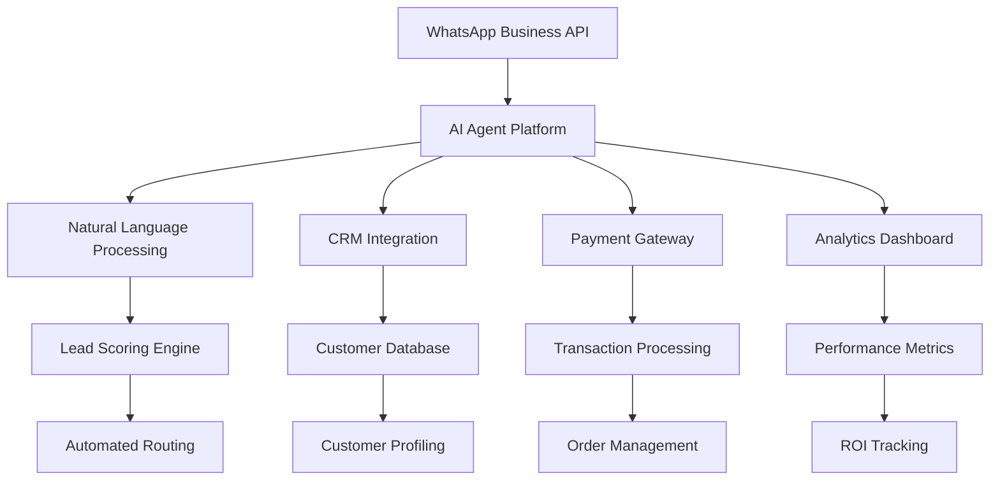

# Ferramentas Agênticas para Vendas no WhatsApp: Guia Completo 2025

*Relatório criado por MiniMax Agent - 17 de novembro de 2025*

## 📊 Resumo Executivo

O mercado de ferramentas agênticas para WhatsApp está experimentando crescimento exponencial em 2025, com a expectativa de que o e-commerce gere mais de **US$ 8 trilhões até 2027**. Empresas como Nike, Samsung e Amazon já implementaram com sucesso soluções de IA conversacional no WhatsApp, com a Samsung alcançando **98% de satisfação do cliente** em apenas 6 semanas.

### 🚀 Impacto nas Vendas
- **Taxa de conversão**: Aumento de 10-15% com sugestões personalizadas <citation>1</citation>
- **Taxa de abertura**: WhatsApp tem 98% vs 20% do email <citation>4</citation>
- **Velocidade de resposta**: 5x mais rápido que métodos tradicionais <citation>4</citation>
- **Redução de CAC**: 50% nos custos de aquisição de clientes <citation>4</citation>

---

## 🎯 Top 12 Ferramentas Agênticas para WhatsApp em 2025

### 1. **BotPenguin** - Melhor Overall
**Foco**: Solução all-in-one acessível e escalável

**Funcionalidades-Chave**:
- 🤖 **Builder sem código** com interface drag-and-drop
- 📢 **Mensagens em massa** para promoções e ofertas
- 📋 **Campanhas de gotejamento** automatizadas
- 🔗 **Integração CRM** (HubSpot, Zoho, Salesforce)
- 👥 **Chat ao vivo** com handover seamless
- 🌍 **Suporte multilíngue** automático
- 📊 **Segmentação de clientes** inteligente

**Preços**: A partir de $15/mês (plano gratuito: 100 conversas)
**Ideal para**: Startups e PMEs que buscam automação completa sem custo elevado <citation>12</citation>

### 2. **Respond.io** - Enterprise-Grade
**Foco**: Plataforma omnichannel para grandes volumes

**Funcionalidades-Chave**:
- 📱 **Inbox unificado** (WhatsApp, Messenger, Instagram, Telegram, WeChat)
- 🔧 **Builder visual** para workflows avançados
- 🎯 **Multi-agente** com roteamento inteligente
- 📈 **Analytics avançados** com ROI tracking
- 🤖 **Integração AI** com GPT próprio ou integrado
- 🔗 **APIs flexíveis** para integrações customizadas

**Preços**: A partir de $79/mês para 1.000 contatos ativos
**Ideal para**: Empresas de médio a grande porte com múltiplos canais <citation>5</citation>

### 3. **Chatfuel** - E-commerce Specialist
**Foco**: Conversação AI para vendas online

**Funcionalidades-Chave**:
- 🛒 **Integração Shopify** profunda
- 💳 **Pagamentos in-chat** seamless
- 🎯 **Catálogo WhatsApp** sincronizado
- 🤖 **AI GPT-powered** para respostas naturais
- 📱 **Multi-plataforma** (WhatsApp, Instagram, Facebook)
- 📞 **Live chat handover** automático

**Preços**: A partir de $49/mês para WhatsApp
**Ideal para**: Lojas online e marcas D2C <citation>12</citation>

### 4. **SleekFlow (AgentFlow)** - Multi-Agente Avançado
**Foco**: Múltiplos agentes especializados por função

**Funcionalidades-Chave**:
- 👥 **Agentes especializados** (qualificação de leads, perguntas técnicas)
- 💰 **Pagamentos in-chat** integrados
- 🌍 **Suporte multilíngue** incluindo dialetos chineses
- 📊 **Analytics de conversão** em tempo real
- 🔗 **Integrações e-commerce** (Shopify, WooCommerce)

**Preços**: A partir de $159/mês para 2.000 contatos
**Ideal para**: Empresas em mercados APAC e casos de uso complexos <citation>12</citation>

### 5. **Interakt** - BSP Oficial Brasil/India
**Foco**: CRM completo com foco em vendas e marketing

**Funcionalidades-Chave**:
- ✅ **BSP oficial** com acesso direto à API
- 📊 **Catálogo WhatsApp** para D2C
- 🎯 **Click-to-WhatsApp ads** integrados
- 📈 **Tracking de conversões** de campanhas
- 🇮🇳 **Suporte local** para mercados emergentes

**Preços**: A partir de $19-25/mês
**Ideal para**: PMEs e marcas D2C focadas em vendas via WhatsApp <citation>12</citation>

---

## 🧠 Estratégias Avançadas de IA Conversacional

### 1. **Automação de Funil de Vendas Completo**

#### **Lead Qualification Inteligente**
```python
# Exemplo de scoring de leads automatizado
lead_score = {
    "intent_keywords": 0.3,
    "budget_indicated": 0.25,
    "timeline_urgent": 0.2,
    "previous_interactions": 0.15,
    "engagement_level": 0.1
}

# AI agente qualifica automaticamente e roteia:
if score >= 0.7:
    route_to("senior_sales_agent")
elif score >= 0.5:
    route_to("automated_nurturing_sequence")
else:
    route_to("educational_content")
```

**Funcionalidades implementadas pelas principais ferramentas**:
- 📝 **Captura conversacional** substitui formulários estáticos
- 🎯 **Scoring em tempo real** baseado no conteúdo da conversa
- 🔄 **Roteamento automático** para agentes apropriados
- 📊 **Enriquecimento de contatos** automático <citation>3</citation>

### 2. **Automação de Agendamentos e Pagamentos**

#### **Processamento Completo de Transações**
- 📅 **Verificação de disponibilidade** em tempo real
- 💳 **Pagamentos in-chat** via gateways integrados
- 📧 **Confirmações automáticas** com recibos
- 🔄 **Gestão de assinaturas** e reembolsos
- ⏰ **Lembretes e preparação** pré-agendamento <citation>4</citation>

### 3. **Suporte Multilíngue Inteligente**

#### **Detecção Automática de Idioma**
```python
# Exemplo de resposta multilíngue
if detected_language == "pt-BR":
    respond_in("Português brasileiro")
elif detected_language == "en":
    respond_in("English")
elif detected_language == "es":
    respond_in("Español")
else:
    respond_in("English")  # fallback
```

**Benefícios comprovados**:
- 🌍 **Expansão global** facilitada
- 💬 **Confiança do cliente** aumentada
- 📈 **Taxa de conversão** melhorada
- 🤝 **Relacionamento** mais próximo <citation>1</citation>

---

## 📈 Tendências e Previsões 2025

### 1. **Experiências Personalizadas com Toque Humano**
- **IA contextual**: Recomendações baseadas em histórico de interações
- **Toque humano**: Agentes focam em problemas complexos e storytelling
- **Dados comportamentais**: Personalização em tempo real <citation>1</citation>

### 2. **Automação de Vendas e Suporte Avançada**
- **Gestão completa do funil**: Da pré-venda ao pós-venda
- **Atualizações constantes**: Ofertas e promoções via push notifications
- **Upsell/cross-sell inteligente**: Sugeridos em tempo real <citation>1</citation>

### 3. **Quebra de Barreiras Linguísticas**
- **Detecção automática**: Preferências linguísticas do consumidor
- **Resposta nativa**: No idioma preferido do cliente
- **Expansão global**: Facilita entrada em novos mercados <citation>1</citation>

### 4. **Campanhas Eficientes com Analytics Avançados**
- **Métricas avançadas**: Bounce rate, engagement rate, ROAS
- **Análise de sentimento**: Insights profundos de campanhas
- **Analytics preditivos**: Antecipação de tendências futuras <citation>1</citation>

### 5. **Integração Seamless com Plataformas E-commerce**
- **Plataformas suportadas**: Shopify, Wix, Squarespace
- **Jornada completa**: Descrição → checkout dentro do WhatsApp
- **Sincronização**: Estoque, preços e disponibilidade <citation>1</citation>

---

## 🛠️ Implementação Prática: Arquitetura de Sistema

### **Stack Tecnológico Recomendado**



### **Componentes-Chave**:
1. **WhatsApp Business Cloud API**
2. **Engine de NLP** (GPT-4, Claude, Gemini)
3. **Sistema de Gestão de Conversas**
4. **Integrações CRM/E-commerce**
5. **Analytics e Reporting**
6. **Payment Processing**

---

## 💰 ROI e Métricas de Performance

### **Estatísticas Comprovadas de Sucesso**

#### **Samsung Digital Assistant**
- ✅ **98% satisfação** do cliente em 6 semanas
- 📞 **Redução de 67%** no volume de chamadas
- ⚡ **Diminuição de 54%** no tempo médio de atendimento <citation>1,4</citation>

#### **Casos de Sucesso Respond.io**
- **Lamarsa Coffee**: 50% de aumento nas vendas em 6 países
- **Sleek**: 3x mais leads qualificados via WhatsApp
- **Kleta**: 100% de crescimento de assinantes em 2 meses <citation>5</citation>

### **Métricas de Impacto Esperadas**:
| Métrica | Melhoria Esperada |
|---------|-------------------|
| Taxa de conversão | +10-15% |
| Velocidade de resposta | 5x mais rápido |
| Redução CAC | -50% |
| Satisfação do cliente | +35% |
| Automação de dúvidas | 90% das rotineiras |

---

## 🎯 Estratégias de Implementação por Segmento

### **1. E-commerce e D2C**
**Ferramentas recomendadas**: Chatfuel, eGrow, SleekFlow
**Foco principal**:
- 🛒 Recuperação de carrinho abandonado
- 💳 Pagamentos in-chat
- 📦 Rastreamento de pedidos
- 🎯 Catálogo de produtos integrado

### **2. SaaS e B2B**
**Ferramentas recomendadas**: Respond.io, Representative24
**Foco principal**:
- 📊 Demonstrações automatizadas
- 🎯 Qualificação de leads enterprise
- 📅 Agendamento de reuniões
- 📈 Follow-up de pipeline

### **3. Serviços Profissionais**
**Ferramentas recomendadas**: WATI, BotPenguin
**Foco principal**:
- 📋 Agendamento de consultas
- 📄 Coleta de documentos
- 💰 Processamento de pagamentos
- 📞 Handover para especialistas

### **4. Mercados Emergentes (India, LATAM)**
**Ferramentas recomendadas**: Interakt, Convozen AI
**Foco principal**:
- 🗣️ Suporte a voz + texto
- 🌍 Multilíngue nativo
- 💰 Preços acessíveis
- 📱 Mobile-first approach

---

## 🔮 O Futuro das Ferramentas Agênticas no WhatsApp

### **Tecnologias Emergentes**

#### **1. GPT-4 e Modelos Avançados**
- 🎯 **Compreensão contextual** mais sofisticada
- 💭 **Raciocínio complexo** para situações únicas
- 🎨 **Geração de conteúdo** personalizada em tempo real <citation>4</citation>

#### **2. Desenvolvimento No-Code**
- 🚀 **Criação acessível** para não-técnicos
- ⚡ **Deploy rápido** de agentes especializados
- 🔧 **Customização flexível** sem programação <citation>4</citation>

#### **3. Integração Blockchain**
- 🔒 **Transações seguras** e verificáveis
- 💰 **Pagamentos em cryptocurrency**
- 📋 **Smart contracts** automatizados <citation>4</citation>

#### **4. Augmented Reality Commerce**
- 🥽 **Try-ons virtuais** para produtos
- 📱 **Visualização 3D** em tempo real
- 🛍️ **Experiências imersivas** de compra <citation>4</citation>

---

## 💡 Recomendações Estratégicas

### **Para Implementação Imediata**:
1. **Comece simples**: Use ferramentas como BotPenguin ou Interakt
2. **Foque no essencial**: Lead qualification + agendamentos
3. **Integre gradualmente**: CRM → E-commerce → Pagamentos
4. **Meça resultados**: Analytics desde o primeiro dia

### **Para Escala Empresarial**:
1. **Arquitetura robusta**: Respond.io ou SleekFlow
2. **Múltiplos agentes**: Especialização por função
3. **Analytics avançados**: ROI tracking detalhado
4. **Integrações customizadas**: APIs para sistemas legados

### **Para Mercados Globais**:
1. **Suporte multilíngue**: Detecção automática de idioma
2. **Localização cultural**: Respostas contextualizadas
3. **Compliance local**: Regulamentações específicas
4. **Suporte 24/7**: Equipes distribuídas ou IA

---

## 🎉 Conclusão

As ferramentas agênticas para vendas no WhatsApp representam uma revolução na interação cliente-empresa. Com **mais de 2,78 bilhões de usuários mensais** e **taxa de abertura de 98%**, o WhatsApp se consolidou como o canal preferido para comunicação empresarial.

**A implementação bem-sucedida requer**:
- ✅ **Escolha da ferramenta** adequada ao seu segmento
- ✅ **Estratégia clara** de implementação gradual
- ✅ **Integração** com sistemas existentes
- ✅ **Métricas** para acompanhamento de ROI

**O futuro pertence às empresas que combinarem**: 
- 🤖 **IA para escala e velocidade**
- 👥 **Humanos para empatia e confiança**
- 📊 **Dados para decisões inteligentes**

---

*Para implementar essas estratégias no seu negócio, recomenda-se começar com uma ferramenta da categoria "Startups e PMEs" e escalar conforme os resultados obtidos.*

**Fontes**:
- Markopolo.ai - The Future of AI in WhatsApp Sales 2025 <citation>1</citation>
- Rhino Agents - WhatsApp AI Automation Guide <citation>4</citation>
- Interakt - Lead Generation Transformation <citation>3</citation>
- Respond.io - Multi-Agent WhatsApp Support <citation>5</citation>
- BotPenguin - 12 Best WhatsApp AI Agents 2025 <citation>12</citation>